# Mục đích project
Demo dbt (data built tool) để tạo ra các data model, dữ liệu raw nằm trên minio
Dùng power BI Kéo báo cáo từ các data model đã tạo ra

**Muốn biết thêm về các câu hỏi thường gặp với dbt xem forder questions**

# Cách chạy project
1. Clone respository
    ```sh
    git clone https://github.com/vohoang2002/Inda_TTS_DBT.git
    ```
2. Khởi tạo nơi chứa dữ liệu raw (minio) và data model (postgres:5433)
Dbt chỉ là công cụ để tạo ra data model từ dữ liệu raw. Dbt không có khả năng lưu trữ dữ liệu sau khi transform
=> Cần 1 nơi RDBMS để chứa data model sinh ra từ DBT (RDBMS hỗ trợ các constrains, kiểm soát truy cập và bảo mật giúp quản lý dữ liệu tốt hơn)
    ```sh
    docker compose up -d
    ```
3. Dựng airflow ui
    ```sh
    cd airflow/
    docker build . -t extending_airflow:v2
    echo -e "AIRFLOW_UID=$(id -u)" > .env
    docker compose up airflow-init
    docker compose up -d
    ```
4. Tạo connection airlfow đến minio và postgres database
Đăng nhập vào minio (tài khoản mật khẩu xem tại file ./docker-compose.yml)

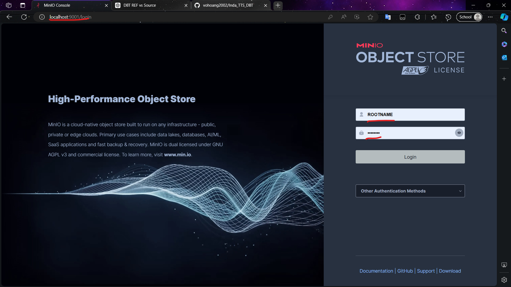

Tạo access key truy cập vào buckbet và download về thư mục minio

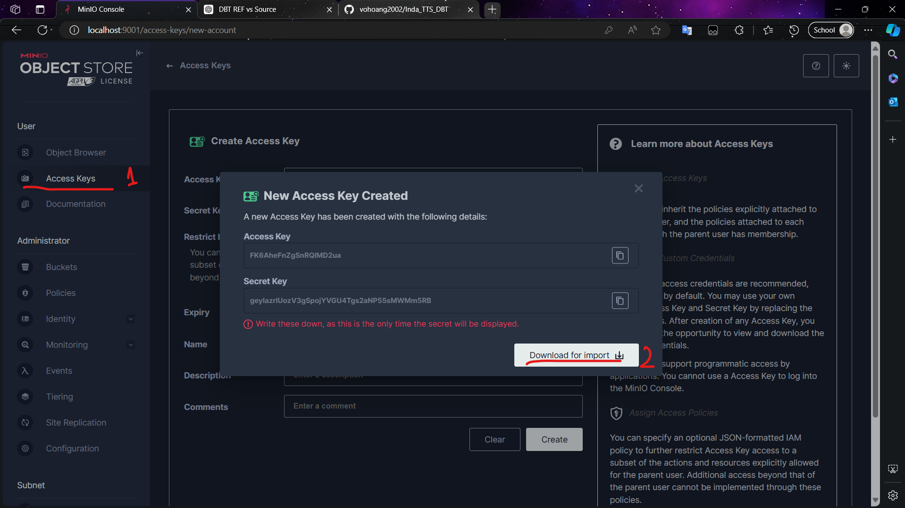

Đăng nhập vào airflow (tài khoản mật khẩu xem tại service postgres tại file ./airflow/docker-compose.yml)

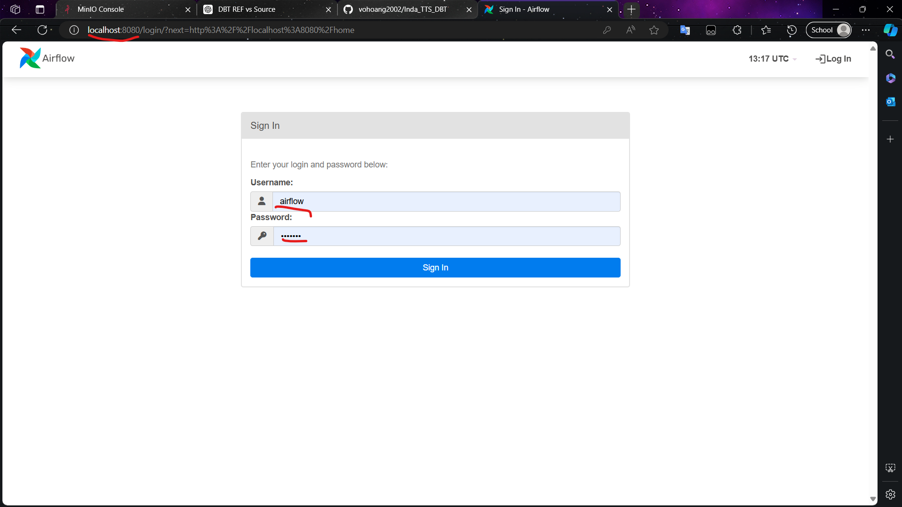

Tạo connection_id trên airflow admin

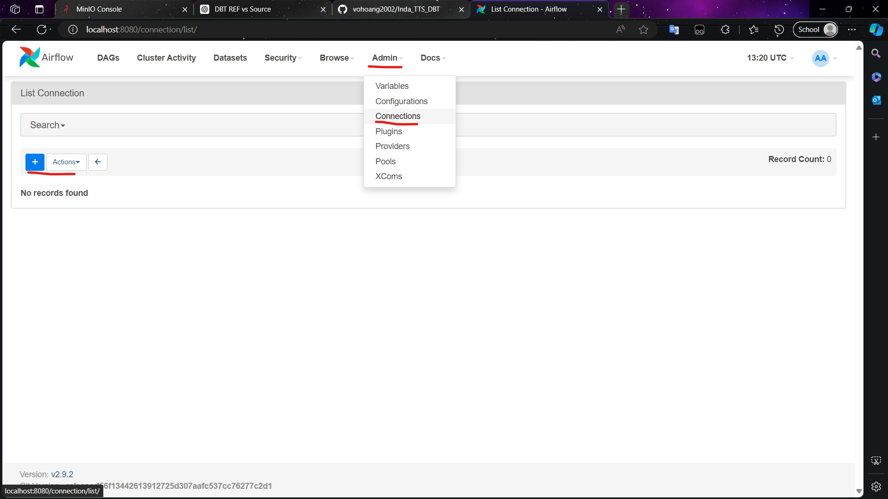

Tạo kết nối từ airflow đến minio (sử dụng file access_key đã download về thư mục minio)

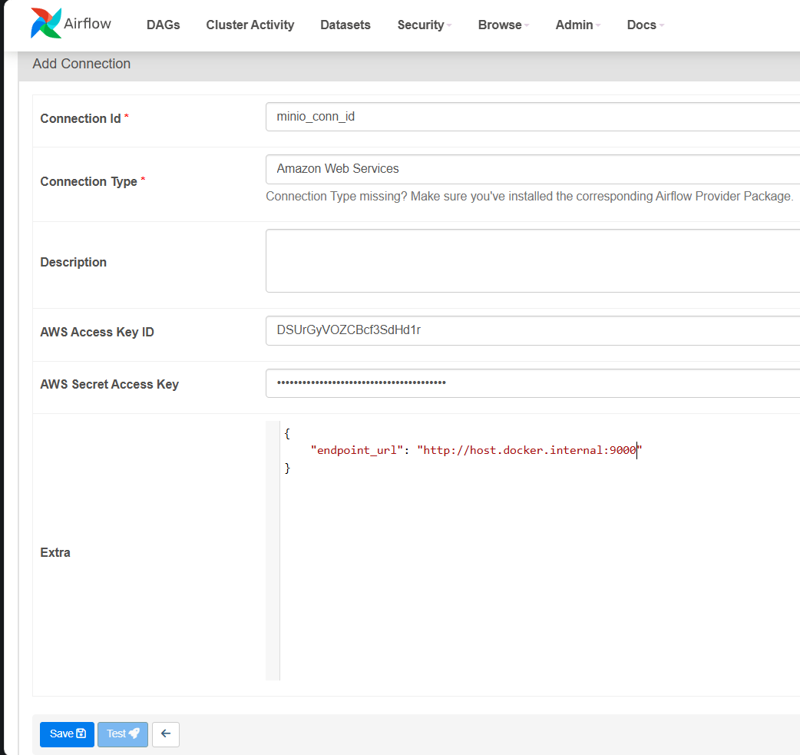

Tạo kết nối từ airflow đến postgres

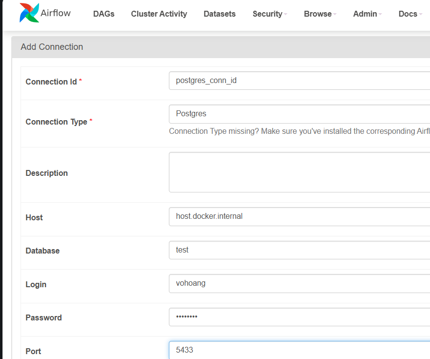

5. Chạy elt script từ postgress

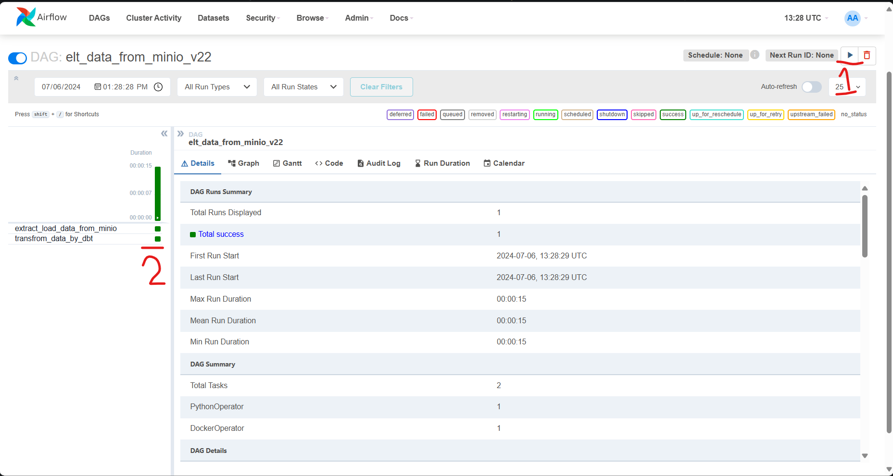

6. Kiểm tra postgres database

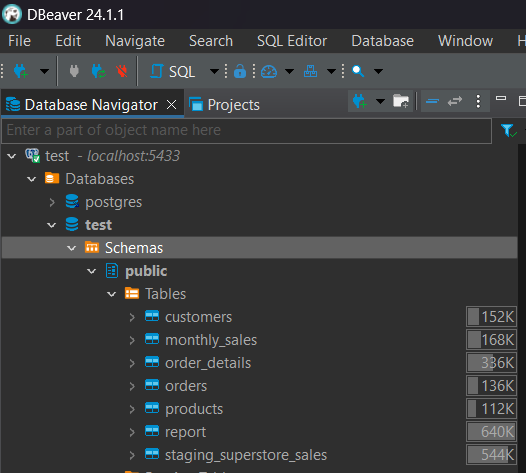

Có thể thấy table report là table load từ dữ liệu raw về (task 1 của elt scrip trên airflow)
Các table còn lại là do dbt tạo ra phục vụ tạo báo cáo

7. Sử dụng bất kỳ công cụ BI nào để tạo báo cáo từ các table do dbt tạo ra bằng cách kết nối đến postgres db (xem mấu tại file report.pbix)

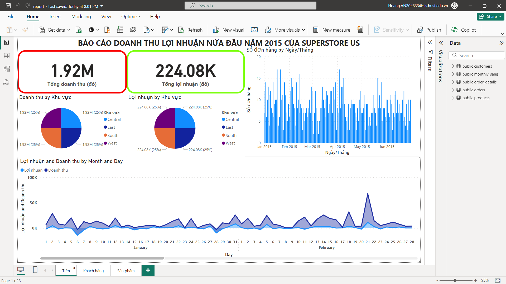

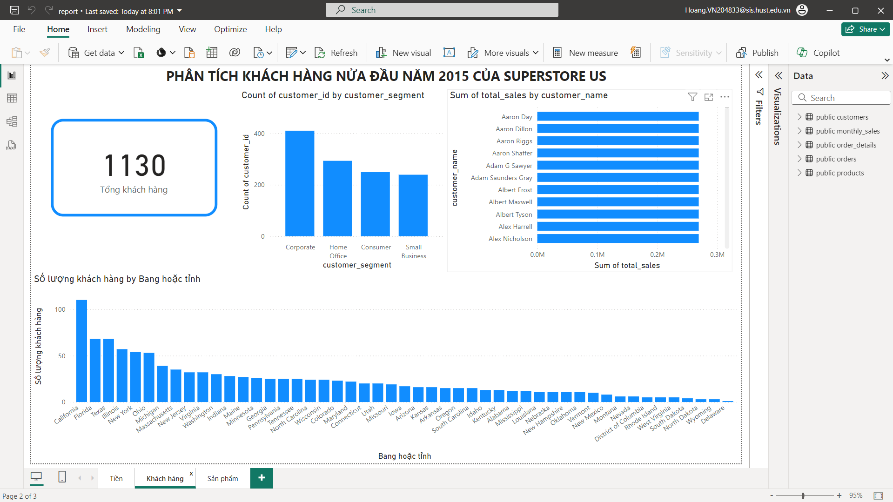

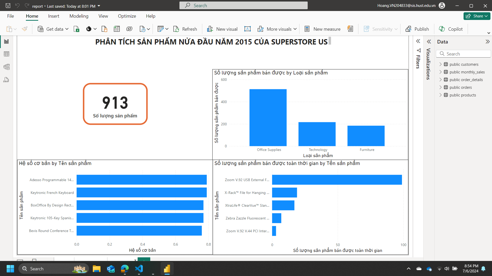

# Dừng porject
```sh
docker compose down -v

cd ..

docker compose down -v
```